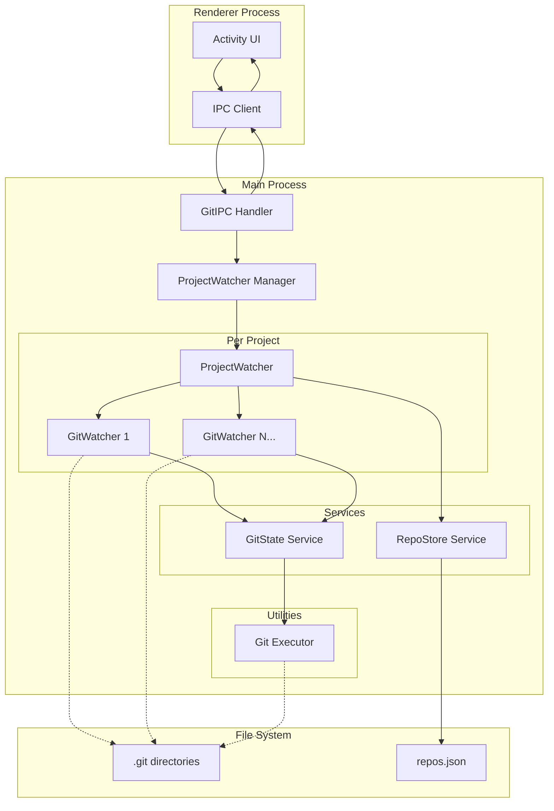

# Design Document

## Overview

The Git monitoring backend is a modular system that integrates with the existing Electron application to provide real-time Git activity tracking. The system monitors local Git repositories when projects are set to "watching" mode and generates activity events that feed into the frontend activity area. The architecture follows a layered approach with clear separation of concerns between Git operations, file system monitoring, state management, and IPC communication.

## Architecture

### High-Level Architecture



### Data Flow

1. **Initialization**: Main process reads existing project watch states and starts ProjectWatchers
2. **File Monitoring**: GitWatchers monitor .git files and detect changes
3. **State Comparison**: Changes trigger state reads and comparisons with previous state
4. **Event Generation**: State differences generate typed activity events
5. **Event Emission**: Events are sent to renderer via IPC for UI display
6. **Periodic Polling**: Remote repositories are fetched periodically for remote updates

## Components and Interfaces

### Core Types (shared/types.ts)

```typescript
// Project and Repository Configuration
interface Project {
  id: string
  name: string
  remoteUrl?: string
  repoFolders: string[]
  watching: boolean
}

interface RepoConfig {
  id: string
  projectId: string
  path: string
  watching: boolean
  last: RepoState
}

// Repository State
interface RepoState {
  branch: string
  head: string
  statusShort: string
  upstream?: string
  ahead: number
  behind: number
  remoteBranches: string[]
  localBranches: string[]
}

// Activity Events
type ActivityType = 
  | 'BRANCH_CREATED' 
  | 'BRANCH_SWITCH' 
  | 'COMMIT' 
  | 'PUSH' 
  | 'MERGE' 
  | 'REMOTE_UPDATE' 
  | 'WORKTREE_CHANGE' 
  | 'ERROR'

interface Activity {
  projectId: string
  repoId: string
  type: ActivityType
  details: any
  at: string
}

// IPC Event Payloads
interface GitEventPayload {
  evt: 'activity' | 'error' | 'watchingOn' | 'watchingOff'
  projectId: string
  repoId?: string
  [key: string]: any
}
```

### Storage Layer (store/RepoStore.ts)

**Purpose**: Persist repository configurations and last known states to JSON file

**Key Methods**:
- `listByProject(projectId: string): RepoConfig[]` - Get all repos for a project
- `upsert(repoCfg: RepoConfig): void` - Create or update repo configuration
- `get(repoId: string): RepoConfig | null` - Get specific repo configuration
- `saveLast(repoId: string, state: RepoState): void` - Update last known state
- `load(): void` - Load from JSON file
- `save(): void` - Persist to JSON file

**Storage Location**: `app.getPath('userData')/repos.json`

### Git Operations Layer (util/gitExec.ts & services/GitState.ts)

**Git Executor (util/gitExec.ts)**:
- Safe subprocess spawning without shell interpolation
- Error handling and timeout management
- Returns structured output: `{ stdout: string }`

**Git State Service (services/GitState.ts)**:
Fast, lightweight Git information readers:

```typescript
interface GitState {
  getBranch(cwd: string): string
  getHead(cwd: string): string
  getStatusShort(cwd: string): string
  getUpstreamAheadBehind(cwd: string): { upstream?: string, ahead: number, behind: number }
  getLastCommitMeta(cwd: string): { hash: string, author: string, subject: string }
  isMergeHead(cwd: string): boolean
  listLocalBranches(cwd: string): string[]
  listRemoteBranches(cwd: string): string[]
}
```

**Git Commands Used**:
- `git symbolic-ref -q --short HEAD` - Current branch
- `git rev-parse HEAD` - Current commit hash
- `git status --short` - Working tree status
- `git branch -vv --no-color` - Upstream tracking info
- `git log -1 --pretty=%H%x1f%an%x1f%s` - Last commit metadata
- `git log -1 --pretty=%P` - Parent commits (merge detection)
- `git for-each-ref refs/heads --format='%(refname:short)'` - Local branches
- `git for-each-ref refs/remotes --format='%(refname:short)'` - Remote branches
- `git fetch --prune` - Update remote references
- `git reflog --date=iso --since=2m` - Recent reflog entries

### Monitoring Layer (services/GitWatcher.ts)

**Purpose**: Monitor individual repository folders for Git changes

**File Watching Strategy**:
- Monitor `.git/HEAD` (branch changes)
- Monitor `.git/index` (staging area changes)  
- Monitor `.git/refs/**` (reference updates)
- Use chokidar for cross-platform file watching
- Debounce events by 300-500ms to prevent spam

**Event Detection Logic**:
```typescript
interface ChangeDetection {
  detectBranchSwitch(prev: RepoState, next: RepoState): Activity | null
  detectCommit(prev: RepoState, next: RepoState): Activity | null
  detectMerge(prev: RepoState, next: RepoState, cwd: string): Activity | null
  detectWorktreeChange(prev: RepoState, next: RepoState): Activity | null
  detectNewLocalBranch(prev: RepoState, next: RepoState): Activity | null
}
```

**Interface**:
```typescript
interface GitWatcher {
  start(repoCfg: RepoConfig, emit: (activity: Activity) => void): void
  stop(repoId: string): void
  isWatching(repoId: string): boolean
}
```

### Project Management Layer (services/ProjectWatcher.ts)

**Purpose**: Coordinate multiple GitWatchers and handle remote polling for a project

**Responsibilities**:
- Manage GitWatcher lifecycle for all project repositories
- Coordinate periodic remote fetching (120s intervals)
- Detect remote changes and push activities
- Aggregate and emit project-level events

**Remote Update Detection**:
```typescript
interface RemoteDetection {
  detectNewRemoteBranch(prev: RepoState, next: RepoState): Activity | null
  detectRemoteUpdate(prev: RepoState, next: RepoState): Activity | null
  detectPush(cwd: string): Activity | null // Via reflog analysis
}
```

**Interface**:
```typescript
interface ProjectWatcher {
  start(projectId: string, repoConfigs: RepoConfig[]): void
  stop(projectId: string): void
  addRepository(repoCfg: RepoConfig): void
  removeRepository(repoId: string): void
  isWatching(projectId: string): boolean
}
```

### IPC Communication Layer (main/ipc/GitIPC.ts)

**Purpose**: Bridge between renderer process and Git monitoring system

**IPC Methods**:
```typescript
interface GitIPC {
  'git:watchProject'(projectId: string, on: boolean): Promise<void>
  'git:listProjectRepos'(projectId: string): Promise<RepoConfig[]>
  'git:getRepoState'(repoId: string): Promise<RepoState>
  'git:connectRepoToProject'(projectId: string, path: string): Promise<RepoConfig>
}
```

**Event Channel**: `git:event`
```typescript
type GitEvent = 
  | { evt: 'activity', projectId: string, repoId: string, type: ActivityType, details: any, at: string }
  | { evt: 'error', projectId: string, repoId?: string, error: string }
  | { evt: 'watchingOn' | 'watchingOff', projectId: string }
```

## Data Models

### Repository State Model

```typescript
interface RepoState {
  branch: string           // Current branch name or "DETACHED"
  head: string            // Current commit SHA
  statusShort: string     // Git status --short output
  upstream?: string       // Upstream branch (e.g., "origin/main")
  ahead: number          // Commits ahead of upstream
  behind: number         // Commits behind upstream
  remoteBranches: string[] // List of remote branch names
  localBranches: string[]  // List of local branch names
}
```

### Activity Event Model

```typescript
interface ActivityDetails {
  // Branch events
  BRANCH_CREATED: { name: string, scope: 'local' | 'remote' }
  BRANCH_SWITCH: { from: string, to: string }
  
  // Commit events  
  COMMIT: { branch: string, head: string, author: string, subject: string }
  MERGE: { branch: string, head: string, parentsCount: number }
  
  // Remote events
  PUSH: { branch: string, head: string }
  REMOTE_UPDATE: { branch: string, ahead: number, behind: number }
  
  // Working tree events
  WORKTREE_CHANGE: { summary: string }
  
  // Error events
  ERROR: { message: string, command?: string }
}
```

## Error Handling

### Git Command Failures
- Graceful degradation when Git commands fail
- Continue monitoring other repositories
- Emit ERROR events for user visibility
- Log detailed error information for debugging

### File System Issues
- Handle permission errors on .git directories
- Recover from temporary file locks
- Restart watchers after file system errors
- Validate repository paths before monitoring

### IPC Communication Errors
- Timeout handling for long-running operations
- Retry logic for transient failures
- Error propagation to renderer process
- Fallback to polling when real-time monitoring fails

## Testing Strategy

### Unit Testing Approach
- **Git State Service**: Mock Git command outputs, test state parsing
- **Change Detection**: Test state comparison logic with various scenarios
- **Event Generation**: Verify correct activity events for state changes
- **Storage Layer**: Test JSON persistence and retrieval operations

### Integration Testing Approach  
- **File Watching**: Test with real .git directories and file changes
- **Git Operations**: Test with actual Git repositories and operations
- **IPC Communication**: Test main/renderer process communication
- **End-to-End Scenarios**: Test complete workflows from Git action to UI event

### Test Repository Setup
- Create temporary Git repositories for testing
- Simulate various Git operations (commit, branch, merge, push)
- Test edge cases (detached HEAD, merge conflicts, empty repositories)
- Verify cleanup and resource management

### Performance Testing
- Monitor memory usage with multiple repositories
- Test file watcher performance with high-frequency changes
- Validate debouncing effectiveness
- Measure Git command execution times